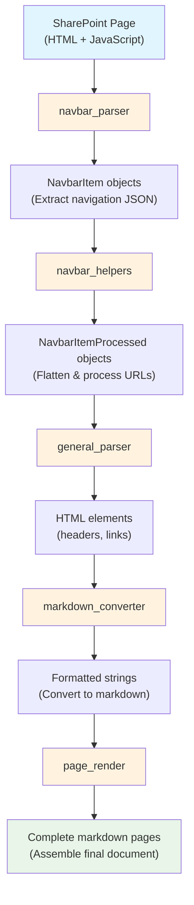

# Development information

This doc details information about setting up and development guidelines.

______________________________________________________________________

# Setting Up

The working directory is at the root of the repo.

```bash
# Install uv (if not already installed)
curl -LsSf https://astral.sh/uv/install.sh | sh

# Create virtual environment and install dependencies
uv sync

# Install Playwright browsers (required for web scraping)
uv run playwright install chromium

# Install the local package in editable mode (automatically handled by uv sync)
# The package is configured in pyproject.toml
```

______________________________________________________________________

# Development Guidelines

## Overarching information

- `uv` is used as the virtual environment manager (configured in pyproject.toml)
  - when running scripts, it should be run as `uv run <path-to-script>`
- `just` (justfile) is used as the task runner

## Build/Lint/Test Commands

- **Lint**: `just lint` (runs ruff check + ty on src/)
- **Format**: `just fmt` (runs ruff format on src/)
- **Tests**: `just test` (unit tests with pytest)

## Project Structure

- **scripts/**: Main execution scripts
- **src/scraper/**: Core scraper modules
- **src/scraper/data_types/**: Type definitions
- **tests/**: Unit tests
- **notebooks/**: Jupyter notebooks for exploration
- **output/**: Generated site data and markdown files
- **SITES.txt**: List of SharePoint sites to process

## Important Files

- **SITES.txt**: Contains list of University of Bristol SharePoint site slugs for batch processing
- **pyproject.toml**: Project configuration and dependencies
- **justfile**: Task runner definitions

______________________________________________________________________

# Architecture

@README.md provides a high-level overview. This section covers technical implementation details.

## Data Flow Architecture



## Key Components

### Core Processing Modules

**`navbar_parser.py`** - Navigation Structure Extraction

- Extracts navigation data from SharePoint JavaScript (`navigationInfo`)
- Parses hierarchical menu structure from JSON embedded in script tags
- Converts raw SharePoint navigation data into structured `NavbarItem` objects
- Handles recursive processing of nested navigation menus

**`navbar_helpers.py`** - Navigation Processing Utilities

- Flattens hierarchical navigation into processable lists
- Updates URLs from relative to absolute paths
- Determines which pages should be scraped based on URL patterns
- Filters out blocked pages (admin, system pages) and handles special cases

**`general_parser.py`** - HTML Content Extraction

- Extracts semantic elements (headers h1-h4, meaningful links) from page HTML
- Focuses on content within `<article>` tags to avoid navigation/chrome
- Filters out empty or anchor-only links to focus on substantive content
- Provides clean, structured data for markdown conversion

**`markdown_converter.py`** - Content Formatting

- Converts HTML elements to markdown format with consistent styling
- Creates hierarchical lists for headers with proper indentation
- Formats links as markdown with descriptive text and URLs
- Maintains document structure and readability

**`page_render.py`** - Document Assembly

- Combines extracted content with navigation metadata
- Generates complete markdown documents using templates
- Applies consistent formatting with headers, metadata, and content sections
- Creates structured output suitable for documentation systems

### Data Structures

**`data_types/navbar.py`** - Navigation Data Models

- `NavbarItem`: Hierarchical navigation structure as extracted from SharePoint
- `NavbarItemProcessed`: Flattened, processed navigation items ready for rendering

**`data_types/render_data.py`** - Rendering Data Models

- `RenderNavbarItem`: Navigation items prepared for markdown generation
- `RenderData`: Complete site data structure for full site rendering

### Configuration

**`config.py`** - System Configuration

- Base URLs and constants for University of Bristol SharePoint
- Centralized configuration management for consistent behavior

## Design Principles

- **Modularity**: Each processing stage is handled by a dedicated module
- **Type Safety**: Comprehensive TypedDict definitions for data structures
- **Functional Style**: Pure functions where possible, clear data transformations
- **Error Handling**: Explicit validation with helpful error messages
- **Extensibility**: Easy to add new content extractors or output formats

## Authentication Handling

The scraper uses Playwright with browser automation to handle University of Bristol SharePoint authentication. The `all-sites.py` script maintains a persistent browser session across multiple sites to avoid repeated authentication prompts.
